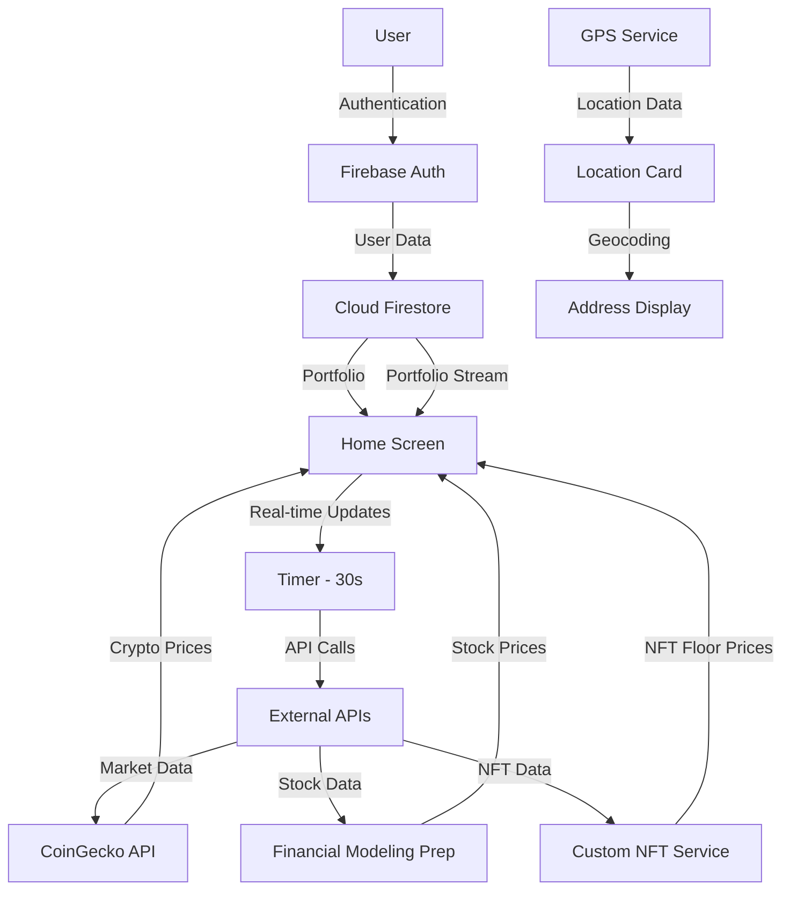

# 🚀 Crypto Exchange Wallet

<div align="center">


**A modern, secure, and feature-rich cryptocurrency wallet application built with Flutter**

[Features](#-features) • [Tech Stack](#-tech-stack) • [Architecture](#-architecture) • [Getting Started](#-getting-started) • [Screenshots](#-screenshots)

</div>

---

## 📱 Overview

Crypto Exchange Wallet adalah aplikasi mobile yang memungkinkan pengguna untuk mengelola portofolio cryptocurrency, saham, dan NFT mereka dalam satu platform yang terintegrasi. Aplikasi ini menyediakan real-time market data, news feed, dan fitur pertukaran crypto yang aman.

## ✨ Features

### 🔐 Authentication & Security
- **Email/Password Authentication** menggunakan Firebase Auth
- **Google Sign-In** untuk kemudahan akses
- **Password Reset** via email
- **Automatic Wallet Generation** saat pendaftaran
- **Secure Data Storage** dengan Firestore

### 💼 Portfolio Management
```
📊 Multi-Asset Support
├── Cryptocurrency (50+ coins)
├── Stocks (20+ popular stocks)
└── NFT Collections (15+ collections)
```

- **Real-time Price Updates** setiap 30 detik
- **Portfolio Value Tracking** dengan persentase perubahan
- **Custom Portfolio** - tambah/kurangi holdings
- **Historical Data** - track performa investasi

### 💱 Exchange & Trading
- **Crypto-to-Crypto Exchange**
- **Real-time Exchange Rates** dari CoinGecko API
- **Network Fee Calculation**
- **Transaction Confirmation** dengan detail lengkap
- **Exchange History** (coming soon)

### 📈 Market Discovery
- **Trending Cryptocurrencies** berdasarkan volume dan market cap
- **News Feed** dengan kategori (Market, Technology, DeFi, NFT, Regulation)
- **Price Charts** dan market statistics
- **Filter & Search** functionality

### 💸 Send & Receive
- **QR Code Generation** untuk menerima crypto
- **QR Code Scanner** untuk kirim crypto
- **Multi-Network Support** (Bitcoin, Ethereum, BSC, Solana, dll)
- **Address Validation**
- **Transaction Notes**

### 📊 Activity Tracking
- **Transaction History** dengan filter
- **Transaction Details** lengkap dengan hash
- **Status Tracking** (Completed, Pending, Failed)
- **Transaction Categories** (Send, Receive, Buy, Sell, Swap)

### 👤 Profile Management
- **User Profile** dengan wallet address
- **Account Verification** status
- **Settings & Preferences**
- **Security Options** (2FA, Password Change)
- **Support Center**

### 📍 Location Services
- **GPS Integration** untuk tracking lokasi pengguna
- **Real-time Location Updates** dengan koordinat akurat
- **Address Geocoding** - konversi koordinat ke alamat lengkap
- **Location Accuracy Indicator** menampilkan tingkat akurasi GPS
- **Altitude & Speed Tracking** untuk data lokasi lengkap
- **Compass Direction** - menampilkan arah mata angin
- **Auto-refresh Location** dengan indikator loading

---

## 🛠 Tech Stack

### Frontend Framework
- **Flutter 3.x** - Cross-platform mobile development
- **Dart 3.x** - Programming language

### Backend & Database
- **Firebase Authentication** - User authentication
- **Cloud Firestore** - NoSQL database untuk user data & portfolio
- **Firebase Storage** - File storage (future implementation)

### API Integration
| Service | Purpose | Endpoint |
|---------|---------|----------|
| **CoinGecko API** | Crypto prices & market data | `api.coingecko.com/api/v3` |
| **Financial Modeling Prep** | Stock market data | `financialmodelingprep.com/api/v3` |
| **Custom NFT Data** | NFT collections & floor prices | Built-in fallback data |

### State Management
- **Provider Pattern** - Untuk state management yang terstruktur
- **ChangeNotifier** - Reactive state updates
- **StatefulWidget** untuk local state
- **StreamBuilder** untuk real-time data
- **Timer** untuk auto-refresh

### Location Services
- **Geolocator** - GPS & location tracking
- **Geocoding** - Reverse geocoding untuk konversi koordinat ke alamat
- **Permission Handler** - Mengelola izin lokasi

### UI/UX Libraries
```dart
dependencies:
  flutter:
    sdk: flutter
  
  # Firebase
  firebase_core: ^2.24.0
  firebase_auth: ^4.15.0
  cloud_firestore: ^4.13.0
  google_sign_in: ^6.1.5
  
  # Network
  http: ^1.1.0
  
  # Location Services
  geolocator: ^10.1.0
  geocoding: ^2.1.1
  
  # UI Components
  qr_flutter: ^4.1.0
  intl: ^0.18.1
  
  # State Management
  provider: ^6.1.1
  
  # Utilities
  flutter/services.dart  # Clipboard, System Chrome
```

---

## 🏗 Architecture

### 📂 Project Structure

```
lib/
├── 📱 screens/              # UI Screens
│   ├── auth_wrapper.dart    # Authentication flow handler
│   ├── login_screen.dart    # Login page
│   ├── register_screen.dart # Registration page
│   ├── home_screen.dart     # Main dashboard
│   ├── activity_screen.dart # Transaction history
│   ├── exchange_screen.dart # Crypto exchange
│   ├── discover_screen.dart # News & trending
│   ├── profile_screen.dart  # User profile
│   ├── send_screen.dart     # Send crypto
│   ├── receive_screen.dart  # Receive crypto
│   └── qr_scanner_screen.dart # QR scanner
│
├── 📦 models/               # Data Models
│   ├── crypto_asset.dart    # Cryptocurrency model
│   ├── stock_asset.dart     # Stock asset model
│   ├── nft_asset.dart       # NFT model
│   ├── transaction.dart     # Transaction model
│   ├── user_profile.dart    # User profile model
│   └── news_article.dart    # News article model
│
├── 🔧 services/             # Business Logic
│   ├── auth_service.dart    # Authentication service
│   ├── crypto_service.dart  # Crypto API service
│   ├── stock_service.dart   # Stock API service
│   ├── nft_service.dart     # NFT API service
│   ├── wallet_service.dart  # Wallet management
│   └── location_service.dart # GPS & location service
│
├── 🎨 widgets/              # Reusable Components
│   ├── wallet_card.dart     # Portfolio summary card
│   ├── crypto_list_item.dart # Crypto item widget
│   ├── transaction_item.dart # Transaction item widget
│   ├── bottom_nav_bar.dart  # Navigation bar
│   ├── news_card.dart       # News item widget
│   └── location_card.dart   # Location display widget
│
├── 🎨 utils/                # Utilities
│   ├── app_colors.dart      # Color constants
│   └── database_initializer.dart # Firebase setup
│
└── main.dart                # App entry point
```

### 🔄 Data Flow



### 🏛 Clean Architecture Implementation

Aplikasi ini mengimplementasikan **Clean Architecture** dengan pemisahan yang jelas antara layer:

#### 1. **Service/Repository Layer** (Business Logic)
- **Lokasi**: `lib/services/`
- **Tanggung Jawab**:
  - Mengambil data dari API eksternal
  - Mengelola komunikasi dengan Firebase
  - Melakukan operasi CRUD pada database
  - GPS & location tracking
  - Data transformation & validation

**Contoh Implementasi**:
```dart
// crypto_service.dart
class CryptoService {
  Future<List<CryptoAsset>> fetchCryptoAssets({int limit = 20}) async {
    // API call logic
    // Data parsing
    // Error handling
  }
}

// location_service.dart
class LocationService {
  Future<Position?> getCurrentLocation() async {
    // GPS positioning logic
    // Permission handling
  }
  
  Future<Map<String, String>> getAddressFromCoordinates() async {
    // Reverse geocoding
    // Address formatting
  }
}
```

#### 2. **UI Layer** (Presentation)
- **Lokasi**: `lib/screens/` dan `lib/widgets/`
- **Tanggung Jawab**:
  - Menampilkan data ke user
  - Handling user interactions
  - Navigation & routing
  - UI state management

**Contoh Implementasi**:
```dart
// home_screen.dart
class _HomeScreenState extends State<HomeScreen> {
  @override
  Widget build(BuildContext context) {
    // Pure UI rendering
    // No business logic here
  }
}
```

#### 3. **State Management dengan Provider**

Aplikasi menggunakan **Provider Pattern** untuk state management yang terstruktur:

**HomeScreenProvider** sebagai contoh implementasi:
```dart
class HomeScreenProvider extends ChangeNotifier {
  // Services injection
  final CryptoService _cryptoService;
  final WalletService _walletService;
  
  // State variables
  List<CryptoAsset> _cryptoAssets = [];
  bool _isLoading = true;
  
  // Getters
  List<CryptoAsset> get cryptoAssets => _cryptoAssets;
  bool get isLoading => _isLoading;
  
  // Business logic methods
  Future<void> loadCryptoData() async {
    _setLoading(true);
    try {
      final assets = await _cryptoService.fetchCryptoAssets();
      _cryptoAssets = assets;
      _resetErrorTracking();
    } catch (e) {
      _trackError(e);
    }
    _setLoading(false);
    notifyListeners();
  }
}
```

**Keuntungan Provider Pattern**:
- ✅ **Separation of Concerns** - Business logic terpisah dari UI
- ✅ **Testability** - Mudah untuk unit testing
- ✅ **Reusability** - Provider dapat digunakan di multiple screens
- ✅ **Reactive Updates** - UI otomatis update saat state berubah
- ✅ **Memory Management** - Proper disposal dengan lifecycle methods

---

## 🔐 Security Implementation

### 1. **Authentication Flow**
```dart
// Firebase Authentication dengan email/password
await _authService.signUp(
  email: email,
  password: password,
  name: name,
);

// Automatic wallet generation setelah signup
String _generateWalletAddress() {
  final timestamp = DateTime.now().millisecondsSinceEpoch;
  final userId = _auth.currentUser?.uid ?? 'unknown';
  final hash = userId.hashCode.abs().toString();
  return '0x${hash}${timestamp}';
}
```

### 2. **Data Protection**
- **Firestore Security Rules** untuk akses data
- **Stream-based Updates** untuk real-time sync
- **Local State Management** untuk sensitive data

### 3. **Transaction Security**
- **Confirmation Dialog** sebelum transaksi
- **Network Fee Calculation**
- **Address Validation**
- **Transaction Hash Generation**

---

## 💾 Database Schema

### Firestore Structure

```
users/
  └── {userId}/
      ├── uid: string
      ├── email: string
      ├── name: string
      ├── walletAddress: string
      ├── isVerified: boolean
      ├── createdAt: timestamp
      ├── currency: string (default: "USD")
      ├── language: string (default: "English")
      └── portfolio/
          ├── {cryptoId}/
          │   ├── amount: number
          │   ├── averagePrice: number
          │   └── lastUpdated: timestamp
          ├── {stockSymbol}/
          │   ├── amount: number
          │   ├── averagePrice: number
          │   └── lastUpdated: timestamp
          └── {nftId}/
              ├── amount: number
              ├── averagePrice: number
              └── lastUpdated: timestamp
```

### CRUD Operations Implementation

Aplikasi ini mengimplementasikan **CRUD (Create, Read, Update, Delete)** operations secara lengkap menggunakan Firebase Firestore:

#### ✅ **CREATE** - Menambah Data Portfolio
```dart
// wallet_service.dart
Future<void> addToPortfolio(String assetId, double amount) async {
  final userId = _auth.currentUser?.uid;
  await _firestore
      .collection('users')
      .doc(userId)
      .collection('portfolio')
      .doc(assetId)
      .set({
    'amount': amount,
    'averagePrice': currentPrice,
    'lastUpdated': FieldValue.serverTimestamp(),
  });
}
```

#### ✅ **READ** - Membaca Data Portfolio
```dart
// Real-time streaming data
Stream<Map<String, double>> portfolioStream() {
  return _firestore
      .collection('users')
      .doc(userId)
      .collection('portfolio')
      .snapshots()
      .map((snapshot) => _parsePortfolioData(snapshot));
}
```

#### ✅ **UPDATE** - Mengupdate Portfolio
```dart
Future<void> updatePortfolio(String assetId, double newAmount) async {
  await _firestore
      .collection('users')
      .doc(userId)
      .collection('portfolio')
      .doc(assetId)
      .update({
    'amount': newAmount,
    'lastUpdated': FieldValue.serverTimestamp(),
  });
}
```

#### ✅ **DELETE** - Menghapus dari Portfolio
```dart
Future<void> removeFromPortfolio(String assetId) async {
  await _firestore
      .collection('users')
      .doc(userId)
      .collection('portfolio')
      .doc(assetId)
      .delete();
}
```

### Sample Data

```json
{
  "users": {
    "user123": {
      "walletAddress": "0x19a15446affabcd1234567890",
      "portfolio": {
        "bitcoin": {
          "amount": 0.04511,
          "averagePrice": 45000.00
        },
        "ethereum": {
          "amount": 3.56,
          "averagePrice": 2500.00
        }
      }
    }
  }
}
```

---

## 📍 GPS & Location Features

### Location Service Implementation

Aplikasi mengimplementasikan **GPS tracking** yang robust dengan fitur lengkap:

#### 🎯 **Features**
- **Real-time GPS Positioning** dengan akurasi tinggi
- **Permission Handling** otomatis untuk izin lokasi
- **Reverse Geocoding** - konversi koordinat ke alamat lengkap
- **Coordinate Formatting** dengan format yang mudah dibaca
- **Altitude Tracking** untuk elevasi lokasi
- **Speed Detection** untuk kecepatan pergerakan
- **Compass Direction** untuk orientasi arah
- **Error Handling** yang comprehensive

#### 🔧 **LocationService Class**
```dart
class LocationService {
  // Get current location with high accuracy
  Future<Position?> getCurrentLocation() async {
    // Check & request permissions
    // Get location with high accuracy settings
    // Handle errors gracefully
  }
  
  // Convert coordinates to address
  Future<Map<String, String>> getAddressFromCoordinates(
    double latitude, 
    double longitude
  ) async {
    // Reverse geocoding
    // Parse address components
    // Format full address
  }
  
  // Utility methods
  static String formatCoordinate(double coordinate);
  static String formatAltitude(double altitude);
  static String formatSpeed(double speed);
  static String getCompassDirection(double heading);
}
```

#### 📱 **LocationCard Widget**
Widget reusable untuk menampilkan informasi lokasi:
- ✅ Refresh button untuk update lokasi
- ✅ Loading indicator saat fetching
- ✅ Error handling dengan pesan informatif
- ✅ Format data yang user-friendly
- ✅ Responsive UI dengan Flexible layout

**Features Displayed**:
- 📍 Full Address (Road, District, City, Province, Country)
- 🎯 GPS Coordinates (Latitude, Longitude)
- 📏 Accuracy Level (dalam meter)
- ⛰️ Altitude (elevasi dari permukaan laut)
- 🚗 Speed (jika bergerak)
- 🧭 Heading & Compass Direction
- ⏱️ Timestamp (waktu update terakhir)

#### 🔒 **Permission Management**
```dart
Future<bool> _handleLocationPermission() async {
  // Check if location services enabled
  if (!serviceEnabled) {
    return false;
  }
  
  // Request permission if needed
  if (permission == LocationPermission.denied) {
    permission = await Geolocator.requestPermission();
  }
  
  return permission != LocationPermission.deniedForever;
}
```

#### 💡 **Error Handling**
- Network errors saat geocoding
- Permission denied scenarios
- Location service disabled
- Timeout handling
- Invalid coordinates

---

## 🚀 Getting Started

### Prerequisites

- Flutter SDK (>=3.0.0)
- Dart SDK (>=3.0.0)
- Firebase Account
- Android Studio / VS Code
- Android SDK / Xcode (untuk iOS)

### Installation

1. **Clone the repository**
```bash
git clone https://github.com/yourusername/crypto-wallet-app.git
cd crypto-wallet-app
```

2. **Install dependencies**
```bash
flutter pub get
```

3. **Firebase Setup**

   a. Create a new Firebase project at [Firebase Console](https://console.firebase.google.com/)
   
   b. Enable Authentication:
   - Email/Password
   - Google Sign-In
   
   c. Create Cloud Firestore database
   
   d. Download `google-services.json` (Android) dan `GoogleService-Info.plist` (iOS)
   
   e. Place files in:
   ```
   android/app/google-services.json
   ios/Runner/GoogleService-Info.plist
   ```

4. **Configure Firebase**
```bash
# Install Firebase CLI
npm install -g firebase-tools

# Login to Firebase
firebase login

# Initialize FlutterFire
flutterfire configure
```

5. **Configure Location Services**

   **Android** (`android/app/src/main/AndroidManifest.xml`):
   ```xml
   <uses-permission android:name="android.permission.ACCESS_FINE_LOCATION" />
   <uses-permission android:name="android.permission.ACCESS_COARSE_LOCATION" />
   ```

   **iOS** (`ios/Runner/Info.plist`):
   ```xml
   <key>NSLocationWhenInUseUsageDescription</key>
   <string>We need your location to provide location-based services</string>
   <key>NSLocationAlwaysUsageDescription</key>
   <string>We need your location to provide location-based services</string>
   ```

6. **Run the app**
```bash
# Debug mode
flutter run

# Release mode
flutter run --release
```

---

## 📱 User Flow

### 1️⃣ Registration & Onboarding

```
┌─────────────┐     ┌──────────────┐     ┌─────────────┐
│   Splash    │ ──> │    Login     │ ──> │  Register   │
│   Screen    │     │    Screen    │     │   Screen    │
└─────────────┘     └──────────────┘     └─────────────┘
                            │                     │
                            │                     ▼
                            │            ┌─────────────────┐
                            │            │ Create Account  │
                            │            │ Generate Wallet │
                            │            │ Init Portfolio  │
                            │            └─────────────────┘
                            │                     │
                            └─────────┬───────────┘
                                      ▼
                            ┌─────────────────┐
                            │   Home Screen   │
                            │  (Portfolio)    │
                            └─────────────────┘
```

### 2️⃣ Main Features Flow

```
Home Screen
    │
    ├── 📊 View Portfolio
    │   ├── Switch Tabs (Cash/Crypto/Stocks/NFT)
    │   ├── Real-time Price Updates (30s)
    │   └── Tap Asset → Details
    │
    ├── 💱 Exchange
    │   ├── Select From Crypto
    │   ├── Select To Crypto
    │   ├── Enter Amount
    │   ├── Preview Exchange
    │   └── Confirm → Execute
    │
    ├── 📰 Discover
    │   ├── View Trending Cryptos
    │   ├── Browse News (Filter by Category)
    │   └── Tap Article → Read Details
    │
    ├── 📋 Activity
    │   ├── View Transaction History
    │   ├── Filter (All/Sent/Received/Trade)
    │   └── Tap Transaction → Details
    │
    ├── 📍 Location
    │   ├── View Current Location
    │   ├── Get GPS Coordinates
    │   ├── View Full Address
    │   └── Track Movement Data
    │
    └── 👤 Profile
        ├── View User Info
        ├── Edit Profile
        ├── Settings
        └── Logout
```

### 3️⃣ Transaction Flow

#### Send Crypto
```
Home → Send Button
    │
    ├── Select Cryptocurrency
    ├── Enter Recipient Address
    │   ├── Paste from Clipboard
    │   └── Scan QR Code
    ├── Enter Amount
    ├── Add Note (optional)
    ├── Preview Transaction
    │   ├── Network Fee
    │   └── Total Amount
    └── Confirm → Success
```

#### Receive Crypto
```
Home → Receive Button
    │
    ├── Select Cryptocurrency
    ├── Generate QR Code
    ├── Display Wallet Address
    ├── Copy to Clipboard
    └── Share (optional)
```

---

## 🎨 UI/UX Features

### Design System

#### Color Palette
```dart
class AppColors {
  // Background
  static const background = Color(0xFF0A0E27);
  static const cardBackground = Color(0xFF1C2541);
  
  // Text
  static const textPrimary = Color(0xFFF0F3FA);
  static const textSecondary = Color(0xFFA0A3B1);
  
  // Brand
  static const primary = Color(0xFF7B61FF);
  static const gold = Color(0xFFFFC107);
  
  // Status
  static const green = Color(0xFF4CAF50);
  static const red = Color(0xFFF44336);
  static const orange = Color(0xFFFF9800);
}
```

#### Typography
- **Headers**: Bold, 28-32px
- **Body**: Regular, 14-16px
- **Captions**: Regular, 12-14px

#### Components
- **Cards**: Rounded corners (16px), subtle shadows
- **Buttons**: Primary gradient, 12px radius
- **Input Fields**: Dark background, border highlight
- **Bottom Navigation**: Icon + Label, active indicator

### Responsive Design
- **Adaptive Layouts** untuk berbagai ukuran layar
- **SafeArea** untuk notch handling
- **ScrollView** untuk content overflow
- **Flexible Grids** untuk portfolio items

---

# State Management Documentation

## ✅ Implementasi State Management

Aplikasi ini menggunakan **Provider Pattern** dengan `ChangeNotifier` untuk state management yang terstruktur dan maintainable.

---

## 1. Menggunakan Provider Pattern

```dart
class HomeScreenProvider extends ChangeNotifier {
  // Business logic terpisah dari UI
}
```

Menggunakan `ChangeNotifier` yang merupakan bagian dari Provider pattern.

---

## 2. Pemisahan Business Logic dari UI

- **Business Logic**: Semua ada di `HomeScreenProvider` (data fetching, error handling, state management)
- **UI Logic**: Ada di `_HomeScreenState` (tampilan, navigation, user interaction)

---

## 3. State Management Terstruktur Rapi

```dart
// State Variables (jelas dan terorganisir)
List<CryptoAsset> _cryptoAssets = [];
bool _isLoading = true;
AppError? _currentError;

// Methods terpisah per fungsi
Future<void> _loadCryptoData() async { }
void _trackError(AppError error) { }
void _resetErrorTracking() { }
```

---

## 4. Reactive Updates dengan notifyListeners()

```dart
_cryptoAssets = updatedAssets;
_isLoading = false;
notifyListeners(); // ✅ Update UI otomatis
```

---

## 🎯 Kelebihan Implementasi

1. **Separation of Concerns** - Logic dan UI terpisah sempurna
2. **Error Handling** - Terstruktur dengan enum ErrorType dan class AppError
3. **Logging System** - Ada `_logInfo()`, `_logSuccess()`, `_logError()`
4. **Auto-refresh** - Timer untuk update data otomatis
5. **Stream Subscription** - Portfolio stream untuk real-time updates
6. **Rate Limiting** - Ada mekanisme cooldown untuk API calls


## 🔄 API Integration

### CoinGecko API

#### Endpoints Used
```dart
// 1. Market Data
GET /coins/markets
    ?vs_currency=usd
    &order=market_cap_desc
    &per_page=50
    &sparkline=false

// 2. Trending Coins
GET /search/trending

// 3. Single Coin Details
GET /coins/markets?ids={coinId}
```

### CryptoCompare News API

#### Endpoints Used
```dart
GET /news/
    ?lang=EN
    &feeds={news_sources}         // Optional: coindesk,cointelegraph
    &categories={categories}      // Optional: BTC,ETH,Trading,Regulation
    &excludeCategories={exclude}  // Optional: categories to exclude

GET /news/feeds

GET /news/categories
```

#### Response Handling
```dart
Future<List<CryptoAsset>> fetchCryptoAssets({int limit = 20}) async {
  try {
    final response = await http.get(
      Uri.parse('$baseUrl/coins/markets?vs_currency=usd&...'),
    );
    
    if (response.statusCode == 200) {
      final List<dynamic> data = json.decode(response.body);
      return data.map((json) => CryptoAsset.fromJson(json)).toList();
    }
  } catch (e) {
    throw Exception('Error fetching crypto data: $e');
  }
}
```

### Rate Limiting & Error Handling
- **Retry Logic** untuk failed requests
- **Fallback Data** saat API unavailable
- **Loading States** untuk UX
- **Error Messages** yang informatif

---

# CryptoCompare News API Documentation

## ⚠️ Error Handling

### Error Types

| Type | Status | Error Flag | Message | Action |
|------|--------|------------|---------|--------|
| **Network Error** | - | `_hasNewsNetworkError = true` | "No internet connection" | Show retry button |
| **Timeout** | - | `_newsError` | "Connection timeout" | Show retry button |
| **Rate Limit** | 429 | `_isRateLimited = true` | "Too many requests" | Disable retry button |
| **API Error** | 4xx/5xx | `_newsError` | "Failed to load news" | Show retry button |

### Implementation

```dart
try {
  final response = await http.get(uri).timeout(Duration(seconds: 10));
  
  if (response.statusCode == 200) {
    // ✅ Success
    _allNews = parseNewsData(response.body);
    _newsError = null;
    
  } else if (response.statusCode == 429) {
    // ⏳ Rate Limited
    _isRateLimited = true;
    _newsError = "Too many requests. Please wait.";
    
  } else {
    // ❌ API Error
    _newsError = "Failed to load news: HTTP ${response.statusCode}";
  }
  
} on TimeoutException {
  // ⏱️ Timeout
  _newsError = "Connection timeout. Please try again.";
  
} on SocketException {
  // 🔌 Network Error
  _hasNewsNetworkError = true;
  _newsError = "No internet connection. Check your network.";
  
} catch (e) {
  // ⚠️ Unknown Error
  _newsError = "An unexpected error occurred.";
}
```

### UI States

```dart
// Empty State with Error
Widget _buildEmptyState() {
  if (_hasNewsNetworkError) {
    return ErrorWidget(
      icon: Icons.wifi_off_rounded,
      title: "No Internet Connection",
      subtitle: _newsError,
      onRetry: _loadNews,
    );
  }
  
  if (_isRateLimited) {
    return ErrorWidget(
      icon: Icons.hourglass_empty_rounded,
      title: "Too Many Requests",
      subtitle: _newsError,
      onRetry: null, // Disabled
    );
  }
  
  if (_newsError != null) {
    return ErrorWidget(
      icon: Icons.error_outline_rounded,
      title: "Failed to Load",
      subtitle: _newsError,
      onRetry: _loadNews,
    );
  }
  
  return EmptyWidget();
}
```

---

## 📊 Response Format

```json
{
  "Response": "Success",
  "Data": [
    {
      "id": "123456789",
      "title": "Bitcoin Surges Past $80K",
      "body": "Article description...",
      "imageurl": "https://...",
      "source": "coindesk",
      "source_info": {
        "name": "CoinDesk"
      },
      "published_on": 1702123456,
      "tags": "BTC|Bitcoin|Trading",
      "categories": "BTC|Market",
      "url": "https://..."
    }
  ]
}
```

## 🧪 Testing

### Unit Tests (Coming Soon)
```bash
flutter test
```

### Widget Tests (Coming Soon)
```bash
flutter test test/widget_test.dart
```

### Integration Tests (Coming Soon)
```bash
flutter test integration_test
```

---

## 📈 Performance Optimization

### 1. **Data Caching**
- Local state untuk reduce API calls
- Timer-based refresh (30s interval)
- Stream-based real-time updates

### 2. **Image Optimization**
- Network images dengan error handling
- Placeholder images
- Lazy loading untuk lists

### 3. **Code Optimization**
- Async/await untuk non-blocking operations
- Dispose controllers untuk prevent memory leaks
- Efficient state management

---

## 🛣 Roadmap

### Phase 1 (Current) ✅
- ✅ Basic authentication
- ✅ Portfolio management
- ✅ Exchange functionality
- ✅ News feed
- ✅ GPS & Location tracking
- ✅ CRUD operations dengan Firebase
- ✅ Provider state management

### Phase 2 (Q2 2024)
- 🔄 Real QR code scanning
- 🔄 Advanced charts
- 🔄 Push notifications
- 🔄 Transaction history export

### Phase 3 (Q3 2024)
- 📋 DeFi integration
- 📋 Staking features
- 📋 Advanced analytics
- 📋 Multi-language support

### Phase 4 (Q4 2024)
- 📋 Web3 wallet integration
- 📋 Hardware wallet support
- 📋 Advanced security (Biometric)
- 📋 Social features

---

## 🤝 Contributing

Contributions are welcome! Please feel free to submit a Pull Request.

1. Fork the project
2. Create your feature branch (`git checkout -b feature/AmazingFeature`)
3. Commit your changes (`git commit -m 'Add some AmazingFeature'`)
4. Push to the branch (`git push origin feature/AmazingFeature`)
5. Open a Pull Request

---

## 📄 License

This project is licensed under the MIT License - see the [LICENSE](LICENSE) file for details.

---

## 👨‍💻 Developer

**Your Name**
- GitHub: [@Mutawali89](https://github.com/Mutawali89)
- Email: qmutawali@gmail.com

---

## 🙏 Acknowledgments

- [Flutter](https://flutter.dev/) - UI framework
- [Firebase](https://firebase.google.com/) - Backend services
- [CoinGecko](https://www.coingecko.com/) - Crypto market data
- [Financial Modeling Prep](https://financialmodelingprep.com/) - Stock market data
- [Geolocator](https://pub.dev/packages/geolocator) - Location services
- [Provider](https://pub.dev/packages/provider) - State management

---

<div align="center">

**⭐ If you like this project, please give it a star! ⭐**

Made with ❤️ using Flutter

</div>
